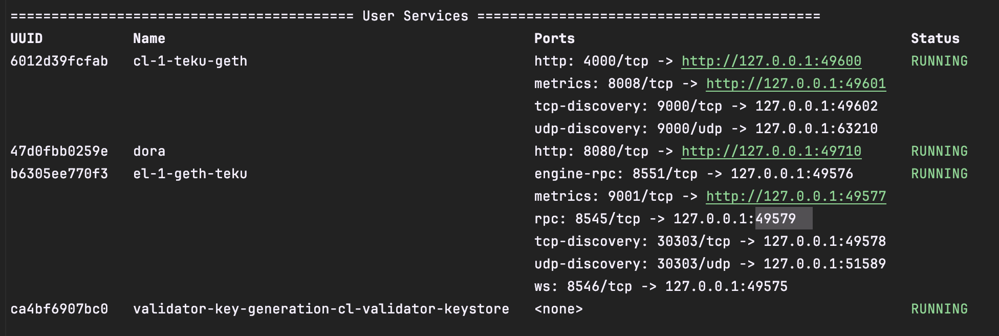
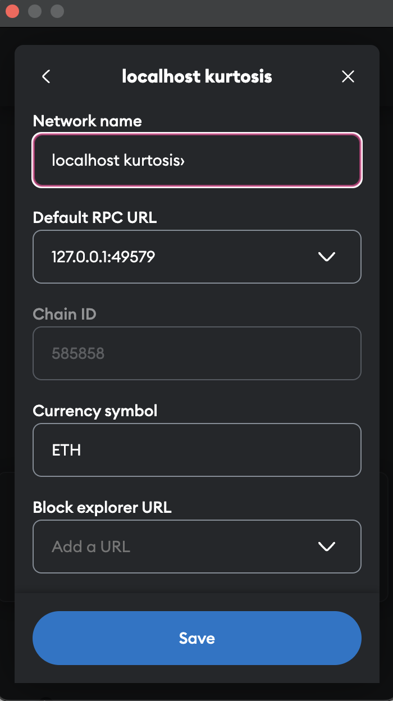

## Requirements

1. [Kurtosis](https://docs.kurtosis.com/install)
2. [Docker](https://docs.docker.com/get-docker/)
3. [Node.js version 20.x](https://nodejs.org/en/download/)
4. [NPM](https://docs.npmjs.com/downloading-and-installing-node-js-and-npm)

## How to Run 

### 1. Run Private Network with Kurtosis
```
    kurtosis run github.com/ethpandaops/ethereum-package --args-file ./network_params.yaml
```
Copy the output which has `rpc: <port>` and change the port in hardhat.config.ts in `smart-contract` and `off-chain-oracle` to the port of the node.
e.g.

Then, the hardhat.config.ts should look like this:
```
    ... 
    {
        localhost: {
          url: "http://127.0.0.1:49579",
          // Hardcoded externally owned accounts (EOAs) using account from
          // https://github.com/ethpandaops/ethereum-package/blob/main/src/prelaunch_data_generator/genesis_constants/genesis_constants.star
          // this account will pay the gas fees for deploying the smart contract
          accounts: [
            "bcdf20249abf0ed6d944c0288fad489e33f66b3960d9e6229c1cd214ed3bbe31",
          ],
        },
    },
```
### 2. Deploy Oracle Smart Contract
```
    cd smart-contract
    npm install
    npx hardhat compile
    npm run deploy
```
Copy the output which has oracle contract address and make a `.env` file with the address according to `.env.example` in `off-chain-oracle`

### 3. Start Off-Chain Oracle
```
    cd off-chain-oracle
    npm run start:provider
```

### 4. Deploy Project Factory Smart Contract
Before, deploying, make sure to have set up the .env correctly according to .env.example. Remember to change the oracle address to the address of the oracle you just deployed.
```
    cd smart-contract
    npm install
    npx hardhat compile
    npm run deploy:local
```

### 5. Start Frontend
```
    cd frontend
    npm install
    npm run dev
```
Open block explorer: `http://127.0.0.1:5173`

For local development, copy one of the private keys outputted by the kurtosis run command and import as an account in metamask.
Remember to change the network to localhost with following config:


Make sure to match the port of the node with the `rpc` port from kurtosis run output.


